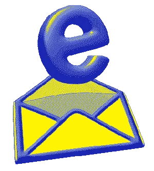

<!-- "Hero" Header -->

  
   
   
    
   
   

<!-- Social -->
<table width="100%" align="center">
<tr>
<td align="center">
<a href="https://tamasmajor.lovable.app/">
<strong>Visit my personal website</strong>
 
 
 

</a>

</td>

<td align="center">
<a href="https://open.spotify.com/playlist/7bM9mZscKO4LMArepHQGjz?si=dd99f373a0d84963">
<strong>Listen to cool music</strong>
 
 

 
</a>

</td>

<td align="center">
<a href="mailto:tamasmajor.work@gmail.com">
<strong>Shoot me an email</strong>
 
 

 
</a>

</td>
</tr>
</table>

<!-- Footer -->

 

&nbsp;&nbsp;&nbsp;&nbsp;  

&nbsp;&nbsp;&nbsp;&nbsp;  

